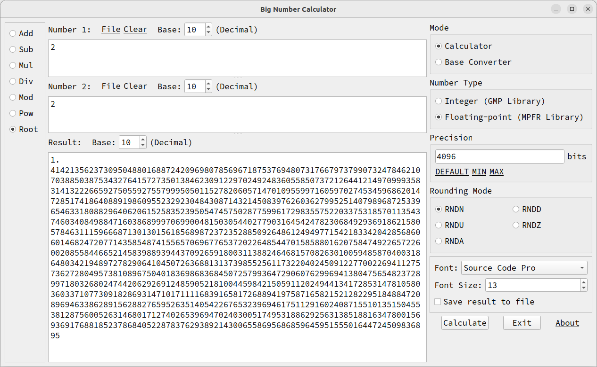

# Big Number Calculator
This is a simple example how to use [GMP](https://gmplib.org) and [MPFR](https://www.mpfr.org) libraries. This project has a GUI based on Qt.

## GMP and MPFR libraries
GMP is a free library for arbitrary precision arithmetic, operating on signed integers, rational numbers, and floating-point numbers. There is no practical limit to the precision except the ones implied by the available memory in the machine GMP runs on.
The MPFR library is a C library for multiple-precision floating-point computations with correct rounding. MPFR is based on the GMP multiple-precision library.

## Authors
- Aboutaleb Roshan [@abroshan39](https://github.com/abroshan39)

## License
This project is licensed under MIT. See the `LICENSE` file.
